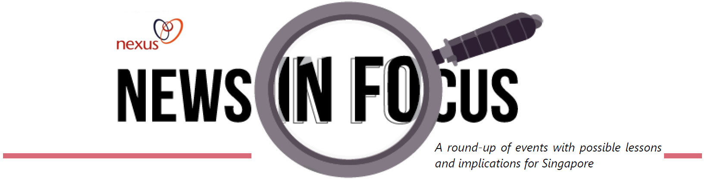
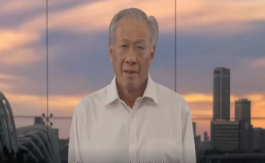
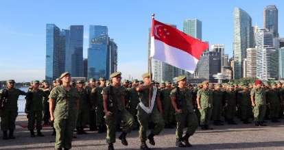
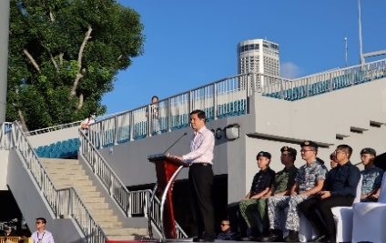
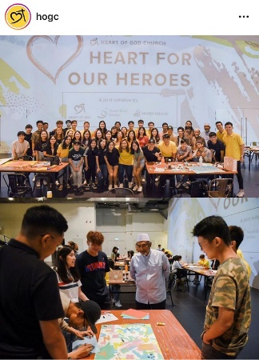
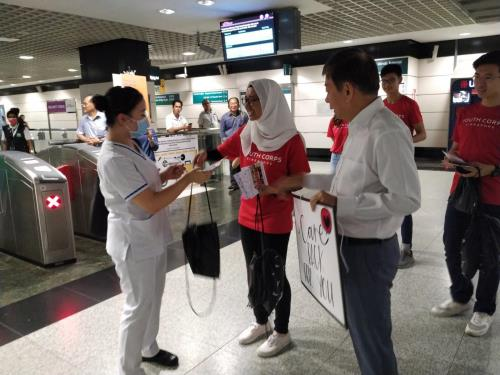
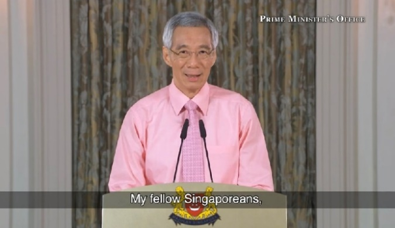
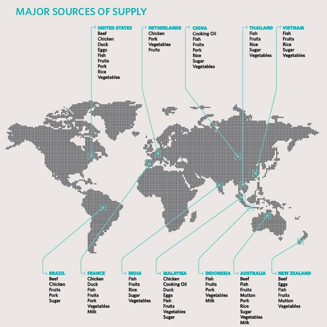
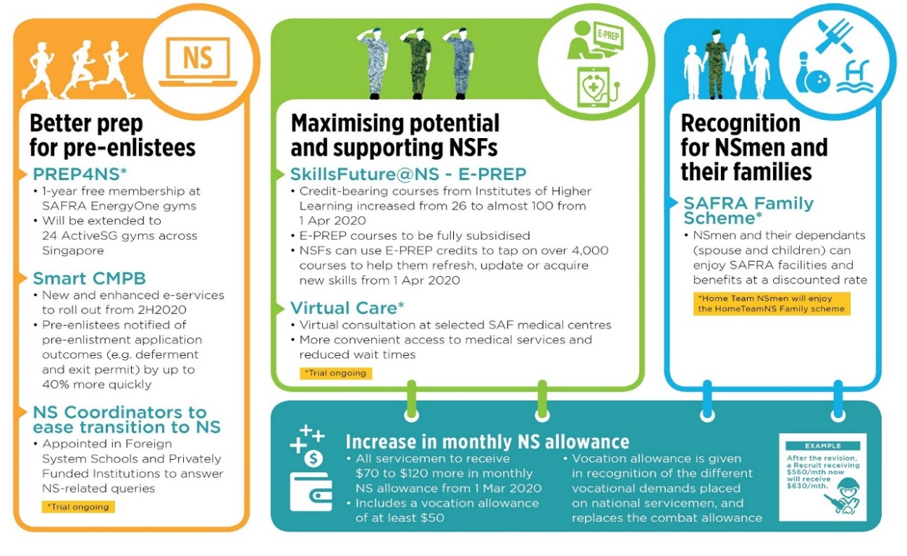

# 1. Total Defence against the Coronavius disease 2019 (COVID-19)

## Total Defence Day Video Message

In his Total Defence Day 2020 message, Minister for Defence Dr Ng Eng Hen highlighted how we must **put Total Defence into action against COVID-19**, just as we did during the SARS crisis in 2003. He emphasised the following four pillars of Total Defence:

*   **Social Defence**. Practise good personal hygiene, distance ourselves from others if sick, show appreciation to our frontline workers, and help those who are infected or under quarantine.
*   **Psychological Defence**. Prepare for ups and downs throughout this viral outbreak, and keep on with our daily lives by taking sensible precautions.
*   **Economic Defence**. Do our part to ensure our economy continues to function, to protect jobs and livelihoods in Singapore.
*   **Digital Defence**. Stamp out distortions, rumours, untruths, misinformation and smears (DRUMS), lest they sow discord, divide our people and weaken our will to defend Singapore.

## Total Defence Day Commemoration Event

On 15 Feb, Minister for Trade and Industry Chan Chun Sing officiated at the Total Defence Day Commemoration event and witnessed the Weapon Presentation Ceremony for 296 recruits. Minister Chan highlighted how everyone must play a part to put Total Defence into action against the COVID-19 outbreak – while Singapore had done reasonably well thus far, there was certainly still room for improvement, and we must never be complacent.

**\[Sources: MINDEF & MTI, 15 Feb; ST, 15-16 Feb\]**

**_Image: MINDEF_**

**\[Source: MINDEF, 14 Feb\]**

**_images: MINDEF_**

## Community-led Initiatives

There have been numerous instances of Singaporeans coming together in our fight against COVID-19.

Here are some examples:

Close to 100 youths from the Heart of God Church (HOGC), Darul Ghufran Mosque and Khalid Mosque came together to create unique pieces of artwork for 22 frontline agencies, as a gesture of appreciation for their service and contributions.

**\[Source: HOGC, 16 Mar\]**

Volunteers and staff from the Youth Corps Singapore distributed care packages to healthcare workers in Tan Tong Seng Hospital and Singapore General Hospital on Valentine’s Day.

**\[Source: Youth.sg, 14 Feb\]**

## Prime Minister’s Address on 12 March 2020

In Prime Minister Lee Hsien Loong’s address to the nation, he said that the situation in Singapore remained under control, and we would remain in the current high risk state for some time. We must also be prepared for a possible spike in the number of cases.

*   Singapore’s strong response to COVID-19 had received international accolades. **Underlying this was the social and psychological resilience of our people**. Singaporeans had responded calmly and responsibly to the government’s direct appeals and reassurances.

*   Everyone had a part to play in this crisis, such as to keep up our guard and take practical precautions while carrying on with our daily lives.

**_Image: PMO-SG_**

**\[Sources: PMO-SG, ST & CNA, 12 Mar\]**

## Securing Our Supply Chains and Stockpiles

In an interview with Ch8’s _Frontline_ on 20 Mar, Minister for Trade and Industry Chan Chun Sing addressed the bout of panic-buying after Malaysia announced movement controls of its citizens. Minister Chan highlighted that **Singapore’s stockpiles could last three to six months**, and that there was no need to panic-buy. **All of us could do our part by buying only what we need, being more open to substitute goods, and supporting local goods,** even though they might have higher prices due to higher manpower and rental costs.

**\[Source: Ch8, 20 Mar\]**

Singapore’s supply chains remain robust. Here’s where our food supplies come from.

**_Image: SFA_**

## Singapore’s Resilience Budget

Since Budget 2020, COVID-19 had escalated rapidly into a global pandemic, with severe disruptions to the global economy. As an open economy that is highly integrated with the global economy, Singapore had been deeply impacted by these global shocks.

On 26 Mar, Deputy Prime Minister Heng Swee Keat announced a landmark **$48.4bn Resilience Budget** that would fund additional support measures. **Together with the $6.4bn support package** that was announced at Budget 2020, **a total of $54.8bn** – amounting to 11% of Singapore’s GDP – would be dedicated to helping us weather the COVID-19 crisis.

**_Our prudence and discipline in saving and growing our reserves give us the wherewithal to respond decisively when our nation faces extraordinary circumstances._**

– DPM Heng during his ministerial statement on additional COVID-19 support measures

The government had obtained President Halimah Yacob’s in-principle support to draw up to $17bn from our past reserves to fund part of this Resilience Package, given the exceptional circumstances that Singapore was in. This would mark only the second time Singapore had drawn on its national reserves, which were built up over the years through prudent spending and set aside to cater for rainy days.

The Resilience Budget focuses on three key areas:

- Save jobs, support workers, and protect livelihoods.
- Help enterprises overcome immediate challenges.
- Strengthen economic and social resilience so that we can emerge intact and stronger.

**\[Sources: MOF, ST & CNA, 26 Mar\]**

# 2. Budget 2020: Enhancing our Defence and National Service to tackle new challenges

At MINDEF’s Committee of Supply Debate in Parliament on 2 Mar, Minister for Defence Dr Ng Eng Hen said that **Singapore and the rest of the world had entered into a less predictable phase of geopolitics**. Key events – including the rise of new principal actors, evolving transatlantic alliances, and increased military spending by Asian countries – had led to our region becoming more militarised and contested.

- As a small city state in an increasingly complex and volatile environment, Singapore had to watch these developments closely, preserve space for ourselves, maintain our sovereignty and pursue our national interests.
- Singapore strengthened defence relations with the US, China and key partners including India and Australia. We had also stepped up efforts to work closely with ASEAN, such as through the “Our Eyes” initiative.
- The SAF would be restructured with ramped-up efforts and capabilities to better tackle security threats such as terrorist, cyber and maritime attacks.**
- We would continue to work towards our goal of world-class training for the Next Generation SAF, while raising, training and sustaining units to deal with both conventional and unconventional threats.

## Enhancing the NS Experience

Senior Minister of State for Defence Heng Chee How said that our people remained our greatest asset, and outlined the ways MINDEF and the SAF would continue to invest in capable national servicemen, enrich their NS experience and strengthen Singaporeans’ support for NS:

- Efforts to strengthen training safety included safety audits and inspections of high-risk activities and training.
- There had been more opportunities for hands-on trainings to enhance SAF medics’ response during medical emergencies.
- Initiatives to enhance the NS experience throughout every serviceman’s NS journey (see infographic below):

**_Image: MINDEF_**

## Strengthening Community Resilience and Digital Defence

Senior Minister of State for Defence Dr Mohamad Maliki Bin Osman said that Total Defence remained our best response to keep Singapore strong. Referring to the ongoing outbreak of COVID-19 as the latest test of our collective strength as a nation, Dr Maliki made the following key points:

- Despite facing pressures from the economic downturn, businesses exemplified economic defence such as by implementing business continuity plans and re-training workers, which helped to build resilience in our economy.
- Although fears of the virus sparked some negative behaviours, there were countless heartwarming examples of how Singaporeans displayed quiet strength and resolve to fight this crisis together.
- In addition to battling the virus, we were also fighting the spread of fake news that could damage our society, erode communal trust and social cohesion.

**_All in all, Singapore can and will overcome this COVID-19 situation if Singaporeans are psychologically resilient and support the government and businesses to deal with this outbreak. We should not be easily rattled and instead, show confidence as a people. As my soldiers often say in Hokkien, “ai zai” or “be steady”._**

– Dr Maliki on the COVID-19 situation in Singapore

- Among broader efforts to increase Singaporeans’ understanding of digital threats, MINDEF/SAF partnered the National Library Board to enrich the BMT curriculum with content on cyber-attacks and information threats. BMT recruits have to complete an e-module on Digital Security in the SAF and visit the Digital Defence exhibition at the Singapore Discovery Centre.

**\[Sources: MINDEF & ST, 2 Mar\]**