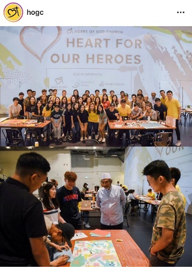
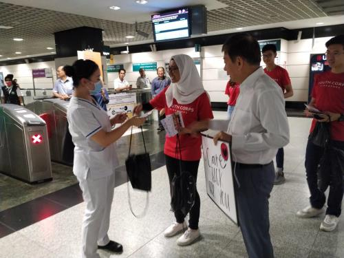
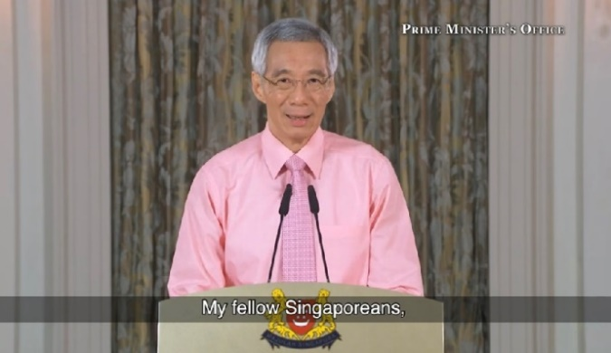
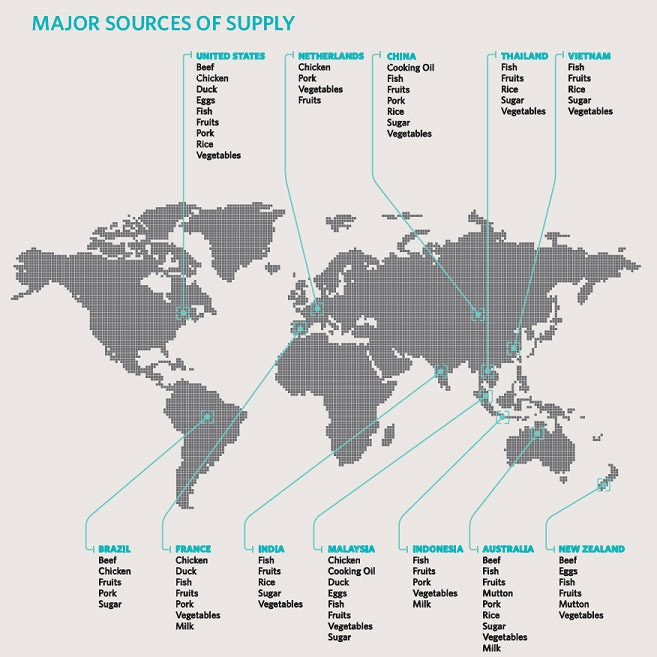
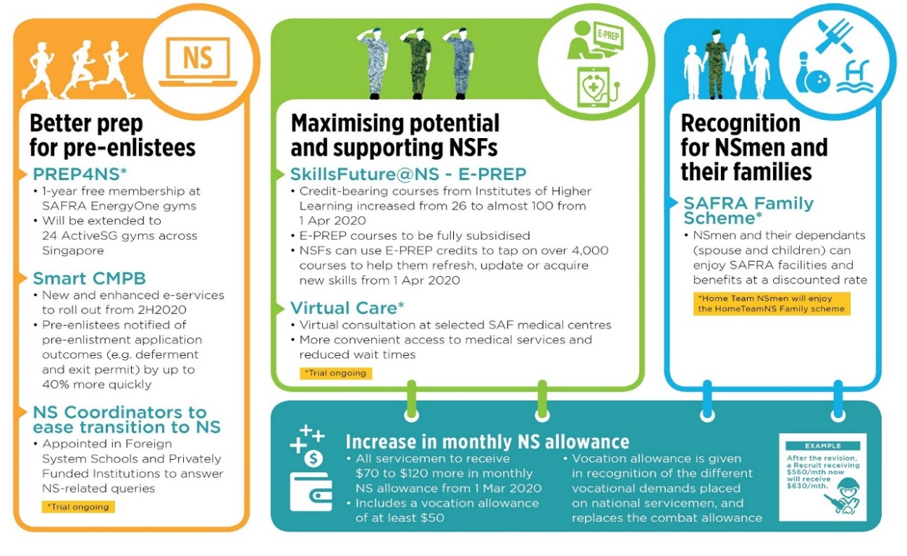

# 1. Applying a Circuit Breaker to Tackle COVID-19
On 3 Apr, strict “circuit breaker” measures were announced by Prime Minister Lee Hsien Loong and the Multi-Ministry Taskforce (MTF) to pre-empt the trend of increasing local transmission of COVID-19. The elevated set of measures was necessary because despite best efforts, there had been more than 50 new cases daily and an increasing number of locally transmitted cases. Also, several clusters in foreign worker dormitories and a nursing home have emerged.

## Stay Home, Stay Safe

The measures, which will be in place from 7 Apr to 4 May, include:

*   Closing most workplaces premises, except essential services or key economic sectors which are critical for local and global supply chains.
*   Full home-based learning for schools and Institutes of Higher Learning. 
*   Closing recreation venues, attractions and places of worship. 
*   Barring social gatherings.

MOH also issued a news release on 3 Apr, asking all Singaporeans to minimise movements and interactions in public and private places, and stay home in order to effectively slow the spread of infection. If people must go out to purchase daily necessities, essential services, or for urgent medical needs, safe distancing should be practised.  

**_"Each and every one of us can, and must do our part, to keep everyone in Singapore safe from COVID-19.”_** -        
– PM Lee Hsien Loong on 3 Apr 

*[Sources: CNA, MOH & PMO, 3 Apr; ST, 10 Apr]*

## Useful Resources
**Information**
*   ***Updates on COVID-19 Local Situation*** ([moh.gov.sg/covid-19](https://moh.gov.sg/covid-19)): For the latest updates and advisories. 
*   ***COVID-19 Situation Dashboard*** ([go.gov.sg/covid-19-dashboard](https://go.gov.sg/covid-19-dashboard)): For a consolidated and official view of the Singapore COVID-19 situation. 
*   ***Gov.sg WhatsApp*** ([go.gov.sg/whatsapp](https://go.gov.sg/whatsapp)) & ***Telegram*** ([t.me/govsg](https://t.me/govsg)): For the latest information about COVID-19, correction of fake news, and important government updates on Telegram. 

**Healthcare-related**
*  ***Singapore COVID-19 Symptom Checker***  ([sgcovidcheck.gov.sg](https://sgcovidcheck.gov.sg)): To help decide on what your next steps should be, based on symptoms experienced.
*   ***Flu Go Where*** ([phpc.gov.sg](https://phpc.gov.sg)): To find a Public Health Preparedness Clinic (PHPC) and polyclinics near you. 

**Safe distancing and contact tracing **
*  ***TraceTogether*** ([tracetogether.gov.sg](https://tracetogether.gov.sg)): A community-driven contact tracing mobile application. 
*   ***Space Out*** ([spaceout.gov.sg](https://spaceout.gov.sg)): To check how crowded shopping centres are.
*   ***Safe Distance @ Parks*** ([safedistparks.nparks.gov.sg](https://safedistparks.nparks.gov.sg)): To check how crowded parks near you are.

Not sure what to do for the #stayhomeforSG Challenge? Try taking on the **Total Defence 14-Day Challenge** (see infographic below and visit We Are Total Defence on [Facebook](https://https://www.facebook.com/WeAreTotalDefence/) or [Instagram](https://https://www.instagram.com/wearetotaldefence/?hl=en)).

## Building Resilience and Emerging Stronger

While COVID-19 has severely diminished global production capacities and disrupted global supply chains, in an oral reply in Parliament on 6 Apr, Minister for Trade and Industry Chan Chun Sing shared Singapore’s multi-pronged strategy to deal with the disruption: 

*  **Stockpiling, import diversification, and local production** to ensure its food supply.  
*  **Working with like-minded partners.** Trading lines with countries like China and South Korea remain open, and a recent agreement with six countries like Australia, Brunei and Canada ensures supply chain connectivity for goods and essential supplies. 

Deputy Prime Minister Heng Swee Keat in Parliament also said on 7 Apr that economic shocks and border closures caused by COVID-19 and the stringent measures put in place will have a big impact on Singapore’s economy. 

**_"The question we should ask ourselves even now is when (the recovery) comes what sort of world it will be, and how ready Singapore will be to march forward again.”_** - 
– DPM Heng Swee Keat in Parliament on 7 Apr 

He added that Singapore’s best response now is to build resilience in our economy and society. Key measures to do that are: 

*  **Two additional support packages** were announced – the S$48.4 billion Resilience Budget and S$5.1 billion Solidarity Budget. These will help viable businesses preserve their capabilities to recover and affected workers to make the best use of this downtime. 
*  A **new Emerging Stronger Task Force** focusing on economic resilience will be set up. Chaired by Minister for Social and Family Development Desmond Lee and PSA International group chief executive Tan Chong Meng, the task force will look for ways that can help Singapore’s economy bounce back from the COVID-19 crisis and be ready to ride the wave of demand when it happens.

*[Sources: CNA, 25 Mar; ST, 2 Apr; CNA & TODAY, 6 Apr; CNA, 7 Apr; CNA & ST, 8 Apr]*
## Community-led Initiatives

There have been numerous instances of Singaporeans coming together in our fight against COVID-19.

Here are some examples:

Close to 100 youths from the Heart of God Church (HOGC), Darul Ghufran Mosque and Khalid Mosque came together to create unique pieces of artwork for 22 frontline agencies, as a gesture of appreciation for their service and contributions.

**\[Source: HOGC, 16 Mar\]**

Volunteers and staff from the Youth Corps Singapore distributed care packages to healthcare workers in Tan Tong Seng Hospital and Singapore General Hospital on Valentine’s Day.

**\[Source: Youth.sg, 14 Feb\]**

## Prime Minister’s Address on 12 March 2020

In Prime Minister Lee Hsien Loong’s address to the nation, he said that the situation in Singapore remained under control, and we would remain in the current high risk state for some time. We must also be prepared for a possible spike in the number of cases.

*   Singapore’s strong response to COVID-19 had received international accolades. **Underlying this was the social and psychological resilience of our people**. Singaporeans had responded calmly and responsibly to the government’s direct appeals and reassurances.

*   Everyone had a part to play in this crisis, such as to keep up our guard and take practical precautions while carrying on with our daily lives.

**_Image: PMO-SG_**

**\[Sources: PMO-SG, ST & CNA, 12 Mar\]**

## Securing Our Supply Chains and Stockpiles

In an interview with Ch8’s _Frontline_ on 20 Mar, Minister for Trade and Industry Chan Chun Sing addressed the bout of panic-buying after Malaysia announced movement controls of its citizens. Minister Chan highlighted that **Singapore’s stockpiles could last three to six months**, and that there was no need to panic-buy. **All of us could do our part by buying only what we need, being more open to substitute goods, and supporting local goods,** even though they might have higher prices due to higher manpower and rental costs.

**\[Source: Ch8, 20 Mar\]**

Singapore’s supply chains remain robust. Here’s where our food supplies come from.

**_Image: SFA_**

## Singapore’s Resilience Budget

Since Budget 2020, COVID-19 had escalated rapidly into a global pandemic, with severe disruptions to the global economy. As an open economy that is highly integrated with the global economy, Singapore had been deeply impacted by these global shocks.

On 26 Mar, Deputy Prime Minister Heng Swee Keat announced a landmark **$48.4bn Resilience Budget** that would fund additional support measures. **Together with the $6.4bn support package** that was announced at Budget 2020, **a total of $54.8bn** – amounting to 11% of Singapore’s GDP – would be dedicated to helping us weather the COVID-19 crisis.

**_Our prudence and discipline in saving and growing our reserves give us the wherewithal to respond decisively when our nation faces extraordinary circumstances._**

– DPM Heng during his ministerial statement on additional COVID-19 support measures

The government had obtained President Halimah Yacob’s in-principle support to draw up to $17bn from our past reserves to fund part of this Resilience Package, given the exceptional circumstances that Singapore was in. This would mark only the second time Singapore had drawn on its national reserves, which were built up over the years through prudent spending and set aside to cater for rainy days.

The Resilience Budget focuses on three key areas:

- Save jobs, support workers, and protect livelihoods.
- Help enterprises overcome immediate challenges.
- Strengthen economic and social resilience so that we can emerge intact and stronger.

**\[Sources: MOF, ST & CNA, 26 Mar\]**

# 2. Budget 2020: Enhancing our Defence and National Service to tackle new challenges

At MINDEF’s Committee of Supply Debate in Parliament on 2 Mar, Minister for Defence Dr Ng Eng Hen said that **Singapore and the rest of the world had entered into a less predictable phase of geopolitics**. Key events – including the rise of new principal actors, evolving transatlantic alliances, and increased military spending by Asian countries – had led to our region becoming more militarised and contested.

- As a small city state in an increasingly complex and volatile environment, Singapore had to watch these developments closely, preserve space for ourselves, maintain our sovereignty and pursue our national interests.
- Singapore strengthened defence relations with the US, China and key partners including India and Australia. We had also stepped up efforts to work closely with ASEAN, such as through the “Our Eyes” initiative.
- The SAF would be restructured with ramped-up efforts and capabilities to better tackle security threats such as terrorist, cyber and maritime attacks.**
- We would continue to work towards our goal of world-class training for the Next Generation SAF, while raising, training and sustaining units to deal with both conventional and unconventional threats.

## Enhancing the NS Experience

Senior Minister of State for Defence Heng Chee How said that our people remained our greatest asset, and outlined the ways MINDEF and the SAF would continue to invest in capable national servicemen, enrich their NS experience and strengthen Singaporeans’ support for NS:

- Efforts to strengthen training safety included safety audits and inspections of high-risk activities and training.
- There had been more opportunities for hands-on trainings to enhance SAF medics’ response during medical emergencies.
- Initiatives to enhance the NS experience throughout every serviceman’s NS journey (see infographic below):

**_Image: MINDEF_**

## Strengthening Community Resilience and Digital Defence

Senior Minister of State for Defence Dr Mohamad Maliki Bin Osman said that Total Defence remained our best response to keep Singapore strong. Referring to the ongoing outbreak of COVID-19 as the latest test of our collective strength as a nation, Dr Maliki made the following key points:

- Despite facing pressures from the economic downturn, businesses exemplified economic defence such as by implementing business continuity plans and re-training workers, which helped to build resilience in our economy.
- Although fears of the virus sparked some negative behaviours, there were countless heartwarming examples of how Singaporeans displayed quiet strength and resolve to fight this crisis together.
- In addition to battling the virus, we were also fighting the spread of fake news that could damage our society, erode communal trust and social cohesion.

**_All in all, Singapore can and will overcome this COVID-19 situation if Singaporeans are psychologically resilient and support the government and businesses to deal with this outbreak. We should not be easily rattled and instead, show confidence as a people. As my soldiers often say in Hokkien, “ai zai” or “be steady”._**

– Dr Maliki on the COVID-19 situation in Singapore

- Among broader efforts to increase Singaporeans’ understanding of digital threats, MINDEF/SAF partnered the National Library Board to enrich the BMT curriculum with content on cyber-attacks and information threats. BMT recruits have to complete an e-module on Digital Security in the SAF and visit the Digital Defence exhibition at the Singapore Discovery Centre.

**\[Sources: MINDEF & ST, 2 Mar\]**
